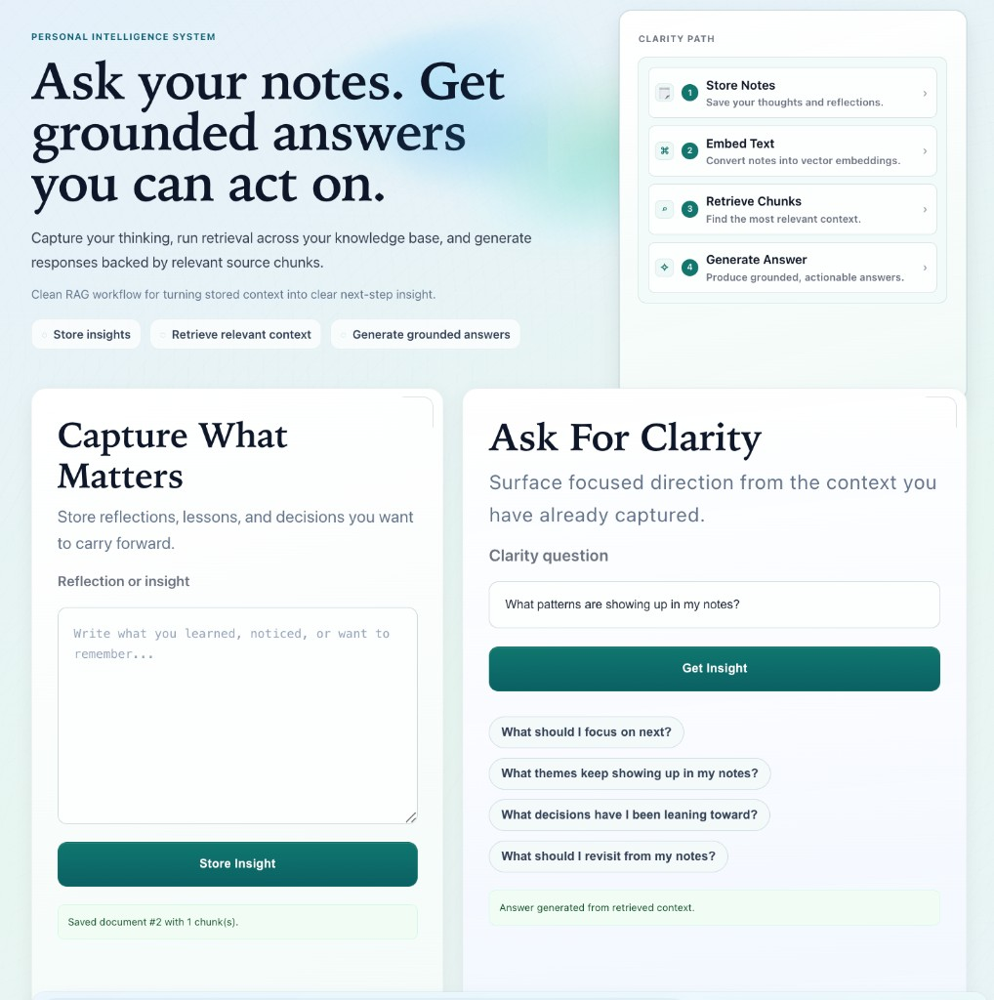
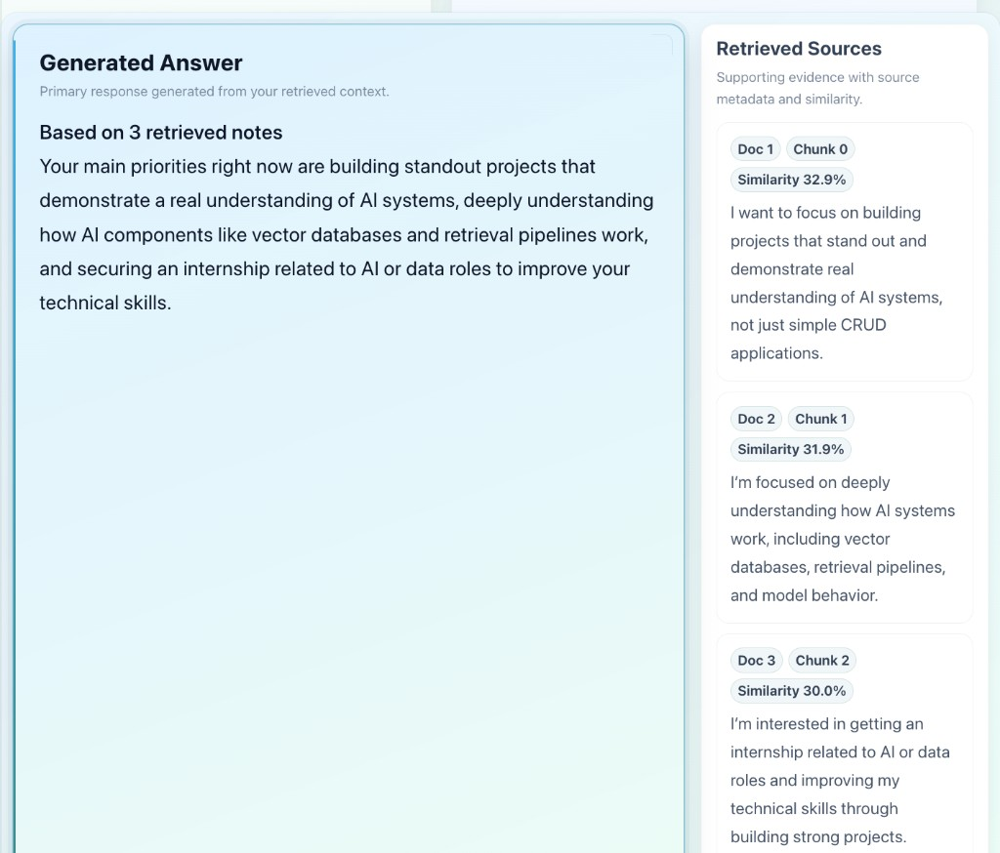
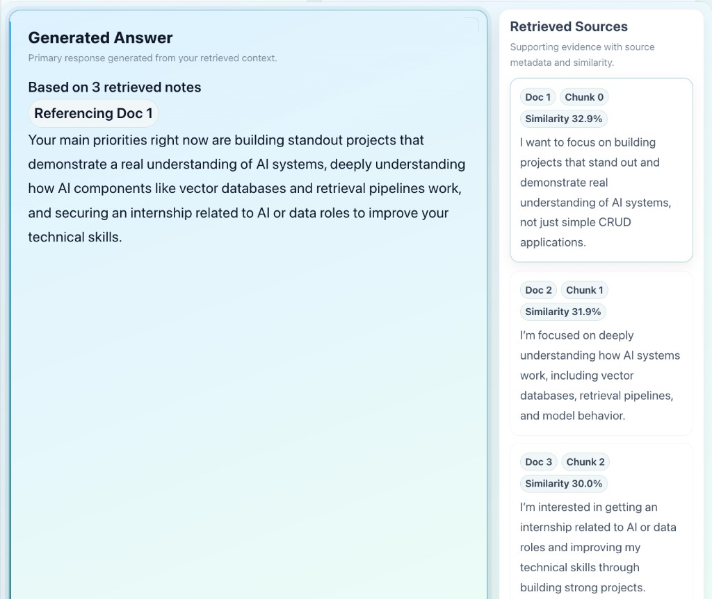

# SignalNote

**SignalNote** is a full-stack AI notes application that turns personal notes into **grounded, interactive insights** using Retrieval-Augmented Generation (RAG).

It allows users to store notes, retrieve semantically relevant context using vector search, and generate answers that are **explicitly tied to their own data**.

👉 **Live Demo:** https://signalnote-euqfuc8ls-varunm354s-projects.vercel.app  
⚠️ Shared demo environment — notes may persist across sessions

---

## 🚀 What makes this different

Most AI apps stop at a prompt box and a direct LLM call.

SignalNote is designed as a full retrieval-first system, where the model is only one component in a larger pipeline.

SignalNote is built as a **complete AI system**, where:
- retrieval comes before generation
- answers are grounded in user data
- users can see *why* an answer was generated

Key product features:
- 🧠 Semantic search over personal notes (pgvector)
- 🔗 Grounded answers with visible source chunks
- 📊 Similarity scoring for retrieved context
- ⚡ Real-time “thinking” states simulating retrieval + generation pipeline stages
- 🎯 Interactive grounding (hover → see which source influences the answer)

---

## 🧪 How it works

1. User writes a note  
2. Backend generates embeddings  
3. Notes + vectors are stored in PostgreSQL (pgvector)  
4. User asks a question  
5. Query is embedded and compared against stored vectors  
6. Top matches are retrieved based on similarity  
7. Top retrieved chunks are aggregated and passed as context to the LLM  
8. The LLM generates a response grounded strictly in retrieved content  
9. UI displays:
   - the answer  
   - supporting sources  
   - similarity scores  
   - interactive grounding cues  

---

## 🧠 Example questions

- What patterns are showing up in my notes?  
- What should I focus on next?  
- What themes keep repeating in my thinking?  
- What decisions have I been leaning toward?  

---

## 🏗️ Tech Stack

### Frontend
- React (Vite)
- JavaScript (ES6+)
- State management with React hooks
- Asynchronous API integration

### Backend
- FastAPI (Python)
- SQLAlchemy ORM
- REST API design

### Database & Retrieval
- PostgreSQL
- pgvector (vector similarity search)
- Embedding storage and retrieval

### AI / RAG Pipeline
- OpenAI Embeddings API
- OpenAI Chat/Completions API
- Text chunking and multi-chunk retrieval
- Similarity-based ranking and context selection

### Deployment
- Vercel (frontend)
- Render (backend)

> Designed and implemented an end-to-end RAG pipeline with embedding generation, vector similarity search, multi-chunk retrieval, and grounded answer synthesis.
---

## ⚙️ Core Engineering Concepts

### 1. Semantic Retrieval (pgvector)
Notes and queries are embedded into vector space and compared using similarity search, enabling meaning-based retrieval instead of keyword matching.

### 2. Retrieval-Augmented Generation (RAG)
The system retrieves relevant note chunks first, then generates answers grounded in that context.

### 3. Multi-chunk Context Synthesis
Instead of using a single match, multiple relevant chunks are retrieved and combined to improve answer quality.

### 4. Grounded AI UX
The UI makes the system transparent:
- shows retrieved sources
- displays similarity scores
- links answers to specific notes through interaction

---

## 🧠 Key Engineering Decisions

- Implemented multi-chunk retrieval instead of single-match lookup to improve answer quality and reduce context loss
- Identified and addressed duplicate retrieval issues caused by embedding similarity across overlapping notes
- Designed frontend interactions (hover-based source highlighting) to improve user trust and explainability of AI outputs
- Structured the system to separate retrieval (pgvector) from generation (LLM) for better control and extensibility

## 🖥️ Demo Experience

When using the app:
1. Add a few notes  
2. Ask a question  
3. See:
   - a grounded answer  
   - supporting source notes  
   - similarity scores  
   - interactive highlighting between answer and sources  

---

## 📸 Screenshots

### Product Overview
A high-level view of the application, including note capture, query input, and system workflow.

---

### Grounded Answer with Retrieved Sources
The system generates answers grounded in your notes and displays supporting context with similarity scores.

---

### Interactive Source Grounding
Hovering over a retrieved source dynamically shows how it influences the generated answer.

