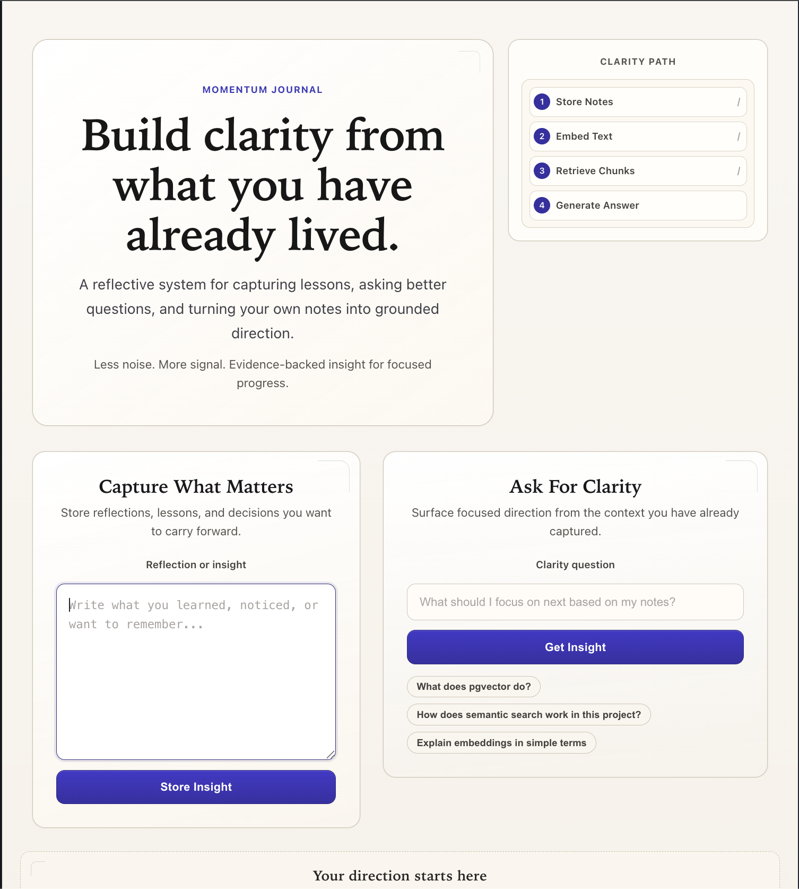
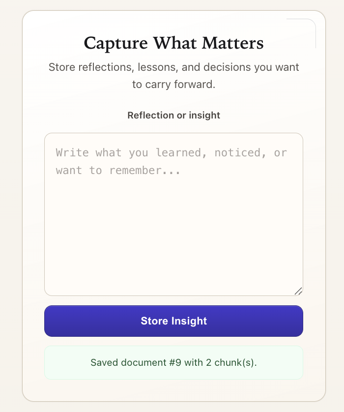
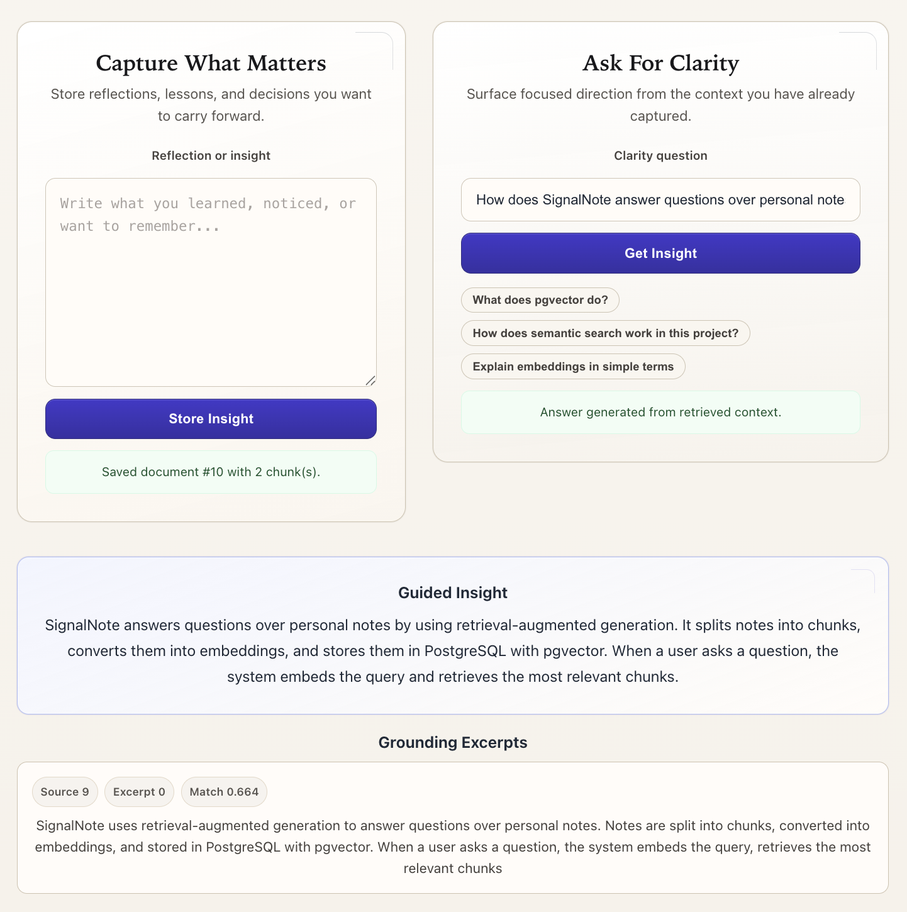

# SignalNote

**SignalNote** is a full-stack Retrieval-Augmented Generation (RAG) application for grounded Q&A over personal notes.  
It ingests freeform reflections and notes, chunks and embeds them into a vector-aware PostgreSQL store, retrieves semantically relevant context with pgvector, and generates evidence-backed answers through a polished React frontend.

## Why this project

Most “AI apps” stop at a prompt box and an LLM call. SignalNote was built to go deeper into the actual system design behind modern AI products:

- **semantic retrieval** over user-owned data
- **chunking + embeddings** for meaning-based search
- **grounded answer generation** instead of freeform model output
- **source transparency** through retrieved supporting chunks
- **full-stack integration** across frontend, backend, vector storage, and model APIs

The goal was to build something closer to a real AI product backend than a thin GPT wrapper.

---

## What it does

SignalNote allows a user to:

- store notes and reflections through a web UI
- automatically chunk note content into retrieval-friendly units
- generate embeddings for each chunk
- store chunk vectors in PostgreSQL with **pgvector**
- ask natural-language questions over stored notes
- retrieve the strongest matching chunks using vector similarity search
- generate answers **only from retrieved context**
- inspect the supporting source chunks used to answer

---

## Demo workflow

1. User writes a note in the frontend  
2. Backend chunks the note into smaller text segments  
3. Each chunk is embedded and stored in PostgreSQL  
4. User asks a question in natural language  
5. Query is embedded into the same vector space  
6. pgvector retrieves the most semantically relevant chunks  
7. Retrieved chunks are filtered and deduplicated  
8. LLM generates a grounded answer using only retrieved context  
9. Frontend displays both the answer and the supporting evidence

---

## System architecture

### Frontend
- **React**
- **Vite**
- Custom CSS

### Backend
- **FastAPI**
- Python

### Storage / Retrieval
- **PostgreSQL**
- **pgvector**

### AI layer
- OpenAI embeddings API
- LLM-based grounded answer generation

---

## Core engineering ideas implemented

### 1. Semantic retrieval instead of keyword matching
Queries are embedded into vector space and compared against stored note chunks using pgvector similarity search. This allows the system to retrieve relevant information by **meaning**, not just exact phrasing.

### 2. Chunking for retrieval quality
Long note content is split into smaller chunks before embedding. This improves retrieval precision by allowing the system to match specific sub-parts of a note rather than forcing one embedding to represent an entire document.

### 3. Grounded generation
The language model does not answer from general memory alone. Instead, it is given retrieved context and instructed to answer only from that evidence, improving trustworthiness and reducing hallucinated responses.

### 4. Retrieval filtering and deduplication
Retrieved chunks are filtered using a relevance threshold and deduplicated before generation. This improves answer quality by reducing noisy or repetitive context.

### 5. End-to-end full-stack workflow
SignalNote is not just an isolated backend script. It includes:
- note ingestion from the frontend
- backend orchestration
- vector storage
- retrieval
- answer generation
- source chunk display in the UI

---

## Example queries

- `What does pgvector do?`
- `How does semantic search work in this project?`
- `Explain embeddings in simple terms.`
- `What themes have I been reflecting on?`

---

## Project structure

```text
signalnote/
  backend/
    app/
      main.py          # FastAPI routes and orchestration
      database.py      # database connection/session setup
      embeddings.py    # embedding generation
      models.py        # data models
      search.py        # retrieval helpers
  frontend/
    src/
      App.jsx          # main React UI
      App.css          # frontend styling
  assets/
    signalnote-hero.png
    signalnote-add-note.png
    signalnote-grounded-answer.png

## Screenshots

### Landing / product view


### Note ingestion flow


### Grounded answer with retrieved chunks
